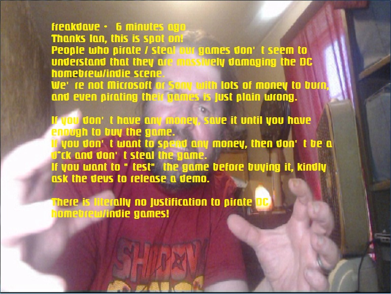

# GDIPATCH
Kos gdi patch
TO build a GDI use IP.BIN from any KATANA game
with this patch you can build CDI and GDI without changes.
And make a GDI digital homebrew that cant be burned easy.
Replace these files in kos and make clean and rebuild.
This all you need to do is replace this in kos it will still work on normal cdr but now it will work also when you make a gdi
image.. GDI for digtal downloads cdi for milcd to be pressed

bios reactivation
You will  need to add a universal reactivation code to all SDKs used, then you won't have to collect images separately
Replace all files and make clean and make rebuild kos and your project..

Dont pirate homebrew indie games support our dev's
 

